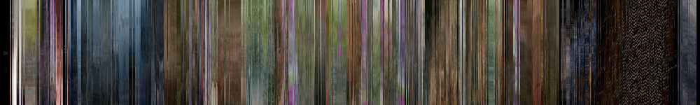

## Description

**nordlicht** converts video files into colorful barcodes. It's heavily inspired by the [moviebarcode tumblr](http://moviebarcode.tumblr.com/movie-index). It takes the video's frames in regular intervals, scales them to 1px width, and appends them. The resulting barcodes can be integrated into video players for simplified navigation.

Here's the barcode of [Tears of Steel](http://tearsofsteel.org/):

An experimental [VLC integration](https://github.com/blinry/vlc) exists, that uses *nordlicht* to generate these barcodes on the fly.

## Installation

If you're using Arch Linux, there's a PKGBUILD in `packages/archlinux`.

Otherwise, get CMake and FFmpeg, and issue

    mkdir build && cd build && cmake .. && make && make install

## Usage

### Tool

Run `nordlicht` to get usage instructions for the command line tool.

### Library

- API documentation: see [src/nordlicht.h](src/nordlicht.h)
- Simple usage example: see [src/nordlicht-tool.c](src/nordlicht-tool.c)

## License

*nordlicht* is free software; you can redistribute it and/or modify it under the terms of the GNU General Public License as published by the Free Software Foundation; either version 2 of the License, or (at your option) any later version.
