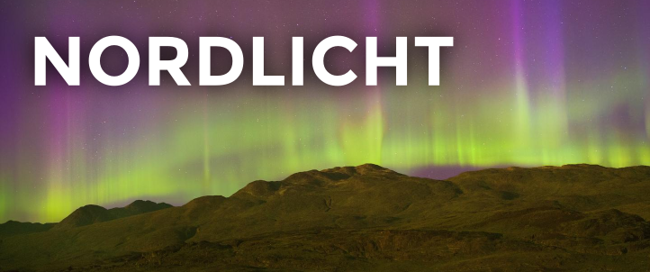
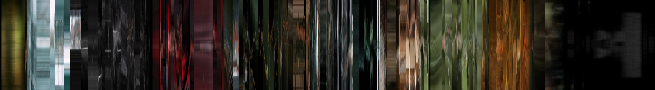

**nordlicht** is a C library for converting video files into colorful barcodes. It is inspired by the [Moviebarcode Tumblr](http://moviebarcode.tumblr.com/), but aims at the next logical step: Integrating these barcodes into video players to make navigation faster and more precise.

*nordlicht* provides a command line tool, which you can use to generate your own barcodes easily.

## Examples

Here's the barcode for [Tears of Steel](http://tearsofsteel.org/). It was created by taking the movie's frames at regular intervals, scaling them to 1 pixel width, and appending them. You can differentiate inside and outside scenes, the credits, and the "secret" scene at the end:

This barcode of [Elephants Dream](http://www.elephantsdream.org/) uses the *vertical* style, which compresses video's frames to columns and rotates them counterclockwise. This style emphasizes the movement of characters:

## Installation

- Arch Linux: Install the [`nordlicht-git`](https://aur.archlinux.org/packages/nordlicht-git/) package from the AUR
- Gentoo: Install the `media-video/nordlicht` package from the [multimedia overlay](https://gitorious.org/gentoo-multimedia/gentoo-multimedia)
- On other distributions, get CMake, FFmpeg, FreeImage, [popt](http://freecode.com/projects/popt), and [help2man](https://www.gnu.org/software/help2man/), and issue: `mkdir build && cd build && cmake .. && make && make install`

## Usage

### Command line tool

Basic usage: `nordlicht video.mkv -w 1000 -h 150 -o barcode.png` converts *video.mkv* to a barcode of 1000 x 150 pixels size and writes it to *barcode.png*. Run `nordlicht --help` to learn more.

### Library

- API documentation: see [src/nordlicht.h](src/nordlicht.h)
- Simple usage example: see [src/main.c](src/main.c)

## Integrations

### mpv

For very recent versions of [mpv](http://mpv.io/), there is an experimental [lua plugin](/utils/mpv-nordlicht.lua). Simply put it in `~/.mpv/lua/` (or symlink it there!) and mpv should display a live-updating barcode of the current video file. You can turn it on and off by pressing `n`. You'll need a version of mpv after commit `d706f81` (>= v0.3.6) and ImageMagick! This is how it looks like (for [Decay](http://www.decayfilm.com/)):

For versions >= 0.2.0, there is an older script called [mpv-nordlicht](/utils/mpv-nordlicht). Put it in your `PATH` and use it instead of `mpv`. It doesn't support multiple files, and you cannot hide the barcode. 

## License: GPLv2+

*nordlicht* is free software; you can redistribute it and/or modify it under the terms of the GNU General Public License as published by the Free Software Foundation; either version 2 of the License, or (at your option) any later version.

The header image shows an Aurora Borealis, which is called "Nordlicht" in German. The picture was taken in Greenland during the [Shelios 2012 expedition](http://shelios.com/sh2012) and is available under the [Creative Commons Attribution-NonCommercial License](https://creativecommons.org/licenses/by-nc/2.0/).
